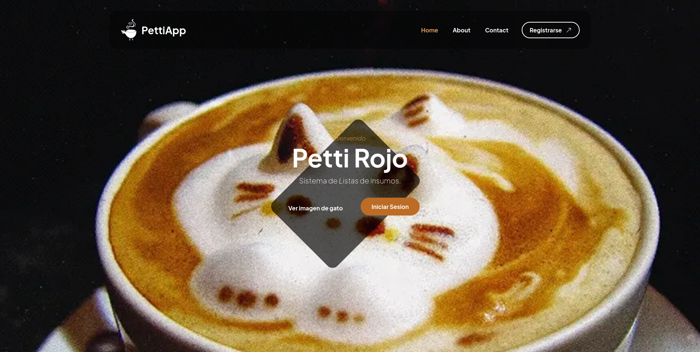
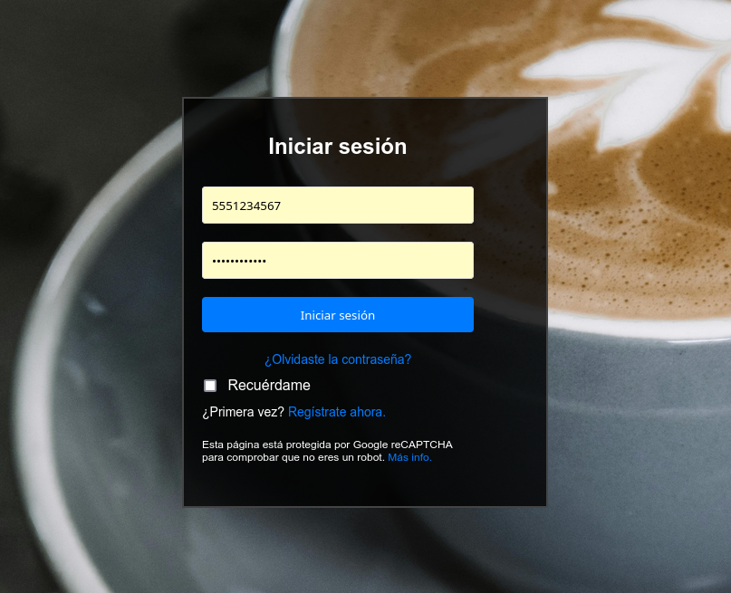
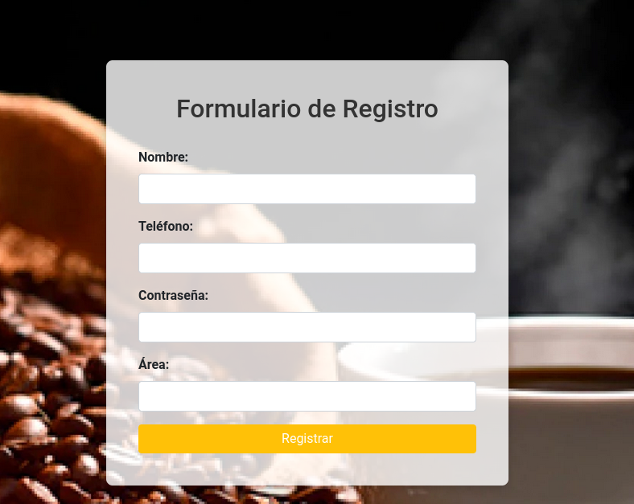
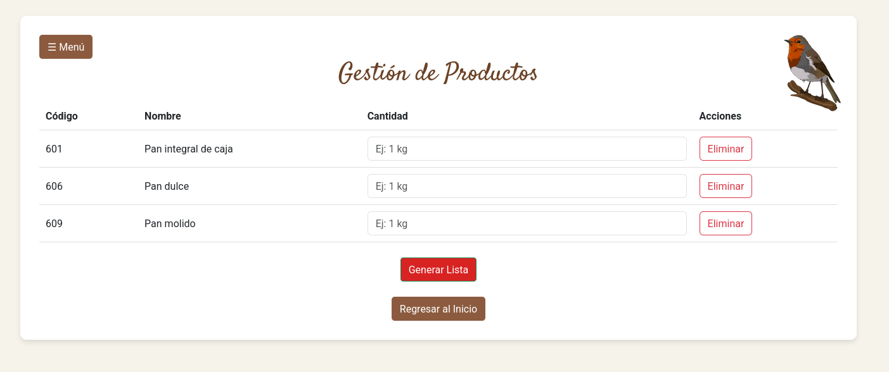
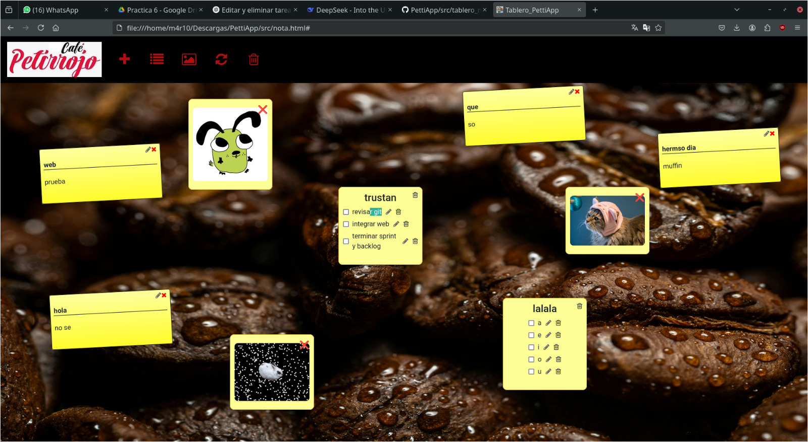
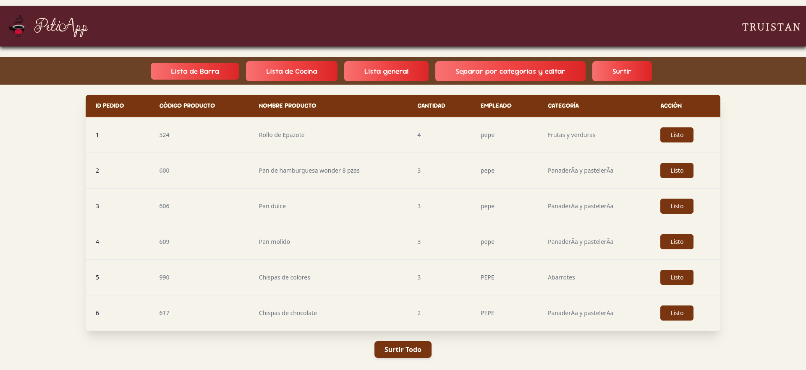
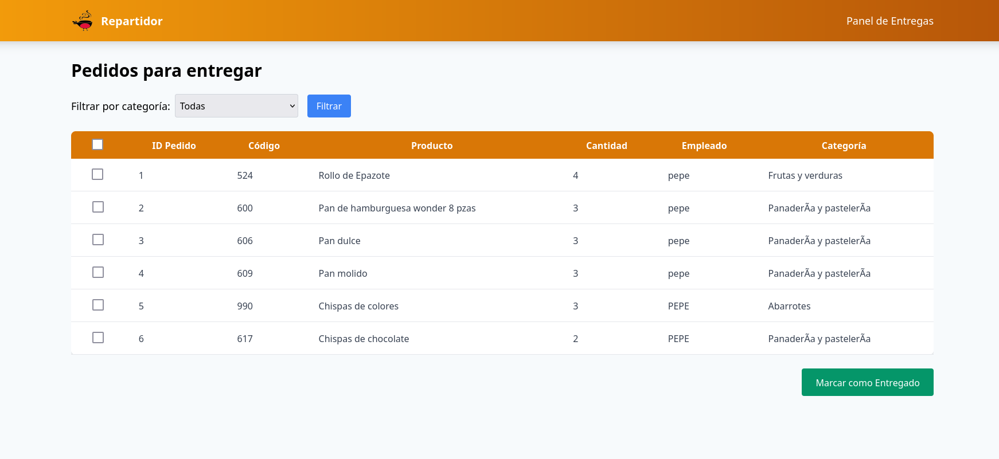

# PettiApp
Esta es una aplicacion web dedicada a administrar la lista de insumos para la cafeteria Petirrojo. En donde los trabajadores podran enlistas los insumos faltantes, consultar los insumos actuales, checar los detalles de los insumos.
Asi mismo este es un proyecto para las materias de Ing.Software/ProgramacionWeb.

---

### Sobre el proyecto:

El personal del negocio podra acceder el sistema de forma simple




Podran Registrarse e inicar sesion


Alo largo de la jornada los empleados podran registrar los insumos faltantes y los podran solicitar


Los empleados tendran notas y todolist, para interactuar entre ellos



El administrador tendra manejara la lista y la autorizara


El repartidor podra surtir los insumos faltantes

---

#### Docker
Realizar esta serie de pasos para poder ejecutar el contenedor
1.  Descarga docker
Recomiendo checar la documentacion dada por OpenSuse, ya que asi evitamos posibles errores, solo es seguir la serie de comandos dados. Sustituir el zypper por apt.
<https://en.opensuse.org/Docker>

2. Crear el contenedor
Para construir la imagen desde cero
```bash
docker-compose up --build -d
```

Para borrar todo lo creado en el contenedor
```bash
docker-compose down -v
```

En caso de hacer modificaciones al proyecto, debes ejecutar estos comandos. Porque asi reiniciamos el contenedor.
IMPORTANTE ESPERAR 2 MINUTOS APROX YA QUE ES LO QUE SE TARDE EN CONECTAR.

Si llegas a presentar errores a la hora de construir el docker muy probablemente tengas conflictos con tus imagenes.

checa que no se este ejecutando ningun servicio de docker
```bash
docker ps
```

en caso de que si deten los servicion y borralos
```
docker stop ID
docker rm ID
```

ahora tienes que ver todas las imagenes que haz creado. Ya que proablemente tenga conflicto con alguna de ellas. Si detectas donde esta la image del problema solo borra esa, sino borra todo lo de la lista
```
docker images
docker rmi -f ID
```

---
### phpadmin
Para poder administrar la BD, acceder como
```
user
password
```

---

### git
Para poder subir el codigo en git realizar lo siguiente
```bash
git init
git add .
git commit -m "beta integraccion"
git remote add origin https://github.com/p3p3p3k4z/PettiApp.git
git checkout -b main
git push origin main --force
```
#### Hacer cambios
```bash
git add .
git commit -m "Descripción de los cambios"
git push origin main
```

#### Recibir cambios
Cuando alguien actualiza su codigo es necesario recibir el codigo mas actualizado
```bash
git pull origin main
```
#### Regresar a una version anterior
```bash
git clone <url-del-repositorio>
git checkout version_1
git log --oneline
git reset --hard <commit-id>
git push --force origin version_1
```
#### Crear una nueva rama
```bash
git checkout -b <nombre-de-la-nueva-rama>
git push origin <rama_creada>
```

#### General llave
Esto es en caso de no admitir la contraseña
<https://github.com/settings/tokens>
